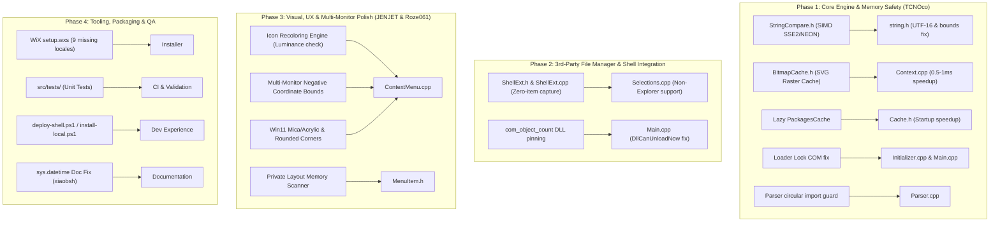

# Nilesoft Shell Revitalization & Fork Integration Plan

## 1. Executive Summary & Objectives

The purpose of this plan is to revitalize the [Nilesoft Shell](file:///c:/Users/j_opp/Projects/Shell) codebase by methodically integrating critical bug fixes, performance optimizations, memory safety improvements, enhanced 3rd-party file manager support, and visual polish from the active forks in the community:
- [**`TCNOco`**](file:///c:/Users/j_opp/Projects/Shell/main...TCNOco_Shell_main.diff.txt) (Core engine safety, SIMD string comparison, SVG bitmap caching, Loader Lock elimination, zero-item shell extension handler, missing installer locales, unit test suite).
- [**`JENJET`**](file:///c:/Users/j_opp/Projects/Shell/main...JENJET_Shell_main.diff.txt) (3rd-party ownerdraw menu private memory scanner, dynamic icon contrast auto-recoloring engine, live PowerShell developer deployment script).
- [**`Roze061`**](file:///c:/Users/j_opp/Projects/Shell/main...Roze061_Shell_main.diff.txt) (Multi-monitor negative coordinate clamping, Win11 rounded corners and Mica/Acrylic backdrops).
- [**`xiaobsh`**](file:///c:/Users/j_opp/Projects/Shell/main...xiaobsh_Nilesoft-Shell-fork_main.diff.txt) (`sys.datetime` documentation accuracy fix).

---

## 2. Fork Integration Architecture & Harmony Assessment



### Compatibility & Conflict Assessment:
1. **Selection Retrieval**: TCNOco's [`ShellExt.h`](file:///c:/Users/j_opp/Projects/Shell/src/dll/src/Include/ShellExt.h) is strictly superior to Roze061's dummy placeholder method (zero UI artifacts, safe per-menu binding). We adopt TCNOco's design.
2. **Icon Pipeline**: TCNOco's SVG [`BitmapCache`](file:///c:/Users/j_opp/Projects/Shell/src/dll/src/Include/BitmapCache.h) and JENJET's [`recolor_icon_bits`](file:///c:/Users/j_opp/Projects/Shell/src/dll/src/ContextMenu.cpp) / [`scan_private_layouts`](file:///c:/Users/j_opp/Projects/Shell/src/dll/src/Include/MenuItem.h) operate on completely separate stages of menu building and combine seamlessly without conflict.
3. **Multi-Monitor Placement**: Both TCNOco and Roze061 fix the negative monitor coordinate bug (`x < ctx->_rcMonitor.left`, `y < ctx->_rcMonitor.top`) with identical logic.
4. **NSS Localization Integrity**: JENJET's hardcoded Chinese `.nss` files will be rejected to preserve the clean multi-language localization structure, while WiX installer is updated to package all 9 previously missing language files.

---

## 3. Detailed Implementation Phases

### Phase 1: Core Engine, Memory Safety & Performance (from TCNOco)

#### 1.1 SIMD String Comparison & Unicode Defect Fix
* **Files**: [NEW] [`src/shared/System/Text/StringCompare.h`](file:///c:/Users/j_opp/Projects/Shell/src/shared/System/Text/StringCompare.h), [MODIFY] [`src/shared/System/Text/string.h`](file:///c:/Users/j_opp/Projects/Shell/src/shared/System/Text/string.h)
* **Changes**:
  * Implement `Ordinal::equals_t` with SSE2 (x86/x64) and NEON (ARM64) intrinsics for 16-bit code unit folding.
  * Replace faulty `::_memicmp` in `string.h` (which was corrupting UTF-16 strings byte-by-byte).
  * Fix out-of-bounds loop terminating condition in `index_of` and `last_index_of`.

#### 1.2 SVG Icon Bitmap Caching & Lazy Package Enumeration
* **Files**: [NEW] [`src/dll/src/Include/BitmapCache.h`](file:///c:/Users/j_opp/Projects/Shell/src/dll/src/Include/BitmapCache.h), [MODIFY] [`src/dll/src/Include/Cache.h`](file:///c:/Users/j_opp/Projects/Shell/src/dll/src/Include/Cache.h), [MODIFY] [`src/dll/src/Expression/Context.cpp`](file:///c:/Users/j_opp/Projects/Shell/src/dll/src/Expression/Context.cpp)
* **Changes**:
  * Implement FNV-1a 64-bit keyed `BitmapCache` to eliminate repeated PlutoSVG re-rendering on every right-click (~0.5–1ms latency savings).
  * Wrap `PackagesCache::load()` in `std::call_once` so the UWP AppX registry and MRT resource table are only parsed on demand.
  * Optimize `FontCache::at` from $O(N)$ linear loop to $O(\log N)$ / map lookup.

#### 1.3 Loader Lock Safety, Hooking & Working Directory Cleanup
* **Files**: [MODIFY] [`src/dll/src/Main.cpp`](file:///c:/Users/j_opp/Projects/Shell/src/dll/src/Main.cpp), [MODIFY] [`src/dll/src/Initializer.cpp`](file:///c:/Users/j_opp/Projects/Shell/src/dll/src/Initializer.cpp), [MODIFY] [`src/dll/src/Include/Initializer.h`](file:///c:/Users/j_opp/Projects/Shell/src/dll/src/Include/Initializer.h), [MODIFY] [`src/dll/src/Selections.cpp`](file:///c:/Users/j_opp/Projects/Shell/src/dll/src/Selections.cpp), [MODIFY] [`src/dll/src/Expression/FuncExpression.cpp`](file:///c:/Users/j_opp/Projects/Shell/src/dll/src/Expression/FuncExpression.cpp)
* **Changes**:
  * Remove `CoInitializeEx` and `IGlobalOptions` from `DllMain` (resolves loader lock violation causing Explorer deadlocks). Move to `Initializer::ensure_com()`.
  * Track active COM instances via atomic `com_object_count` to prevent premature DLL unloading in `DllCanUnloadNow`.
  * Replace quadratic module hook search with `std::unordered_set<HMODULE>`.
  * Remove global `SetCurrentDirectoryW` mutation; pass explicit working directory to `ShellExec::Run`.
  * Remove slow Alt-key `GetAsyncKeyState` hook in `CoCreateInstanceHook`.
  * Memoize Taskbar UI Automation checks with a 250ms thread-local cache.

#### 1.4 Script Parser Hardening
* **Files**: [MODIFY] [`src/dll/src/Parser/Parser.cpp`](file:///c:/Users/j_opp/Projects/Shell/src/dll/src/Parser/Parser.cpp), [MODIFY] [`src/dll/src/Parser/Lexer.h`](file:///c:/Users/j_opp/Projects/Shell/src/dll/src/Parser/Lexer.h)
* **Changes**:
  * Add cycle detection to `Parser::Import()` by checking active `_imports` stack hashes, capping depth to prevent recursion hangs.
  * Root relative imports against the importing file's directory.
  * Clean up unreachable/broken `peek_token` overloads in `Lexer.h`.

---

### Phase 2: Third-Party File Manager Support (from TCNOco)

* **Files**: [NEW] [`src/dll/src/Include/ShellExt.h`](file:///c:/Users/j_opp/Projects/Shell/src/dll/src/Include/ShellExt.h), [NEW] [`src/dll/src/ShellExt.cpp`](file:///c:/Users/j_opp/Projects/Shell/src/dll/src/ShellExt.cpp), [MODIFY] [`src/dll/src/Selections.cpp`](file:///c:/Users/j_opp/Projects/Shell/src/dll/src/Selections.cpp), [MODIFY] [`src/dll/src/Main.cpp`](file:///c:/Users/j_opp/Projects/Shell/src/dll/src/Main.cpp), [MODIFY] [`src/dll/Shell.vcxproj`](file:///c:/Users/j_opp/Projects/Shell/src/dll/Shell.vcxproj)
* **Changes**:
  * Implement `ShellExtHandler`, `ShellExtFactory`, and `ShellExtCapture`.
  * Hand out a real class factory in `DllGetClassObject` for `IID_ContextMenu`.
  * Capture `IDataObject` and folder `PIDL` during `IShellExtInit::Initialize`.
  * Bind capture to the menu handle in `QueryContextMenu` (inserting 0 items).
  * Implement `Selections::QuerySelectedFromHandler()` as a fallback when `WM_GETISHELLBROWSER` is absent.

---

### Phase 3: Visual, UX & Multi-Monitor Polish (from JENJET & Roze061)

#### 3.1 Icon Readability, Dynamic Recoloring & Layout Scanner (JENJET)
* **Files**: [MODIFY] [`src/dll/src/ContextMenu.cpp`](file:///c:/Users/j_opp/Projects/Shell/src/dll/src/ContextMenu.cpp), [MODIFY] [`src/dll/src/Include/MenuItem.h`](file:///c:/Users/j_opp/Projects/Shell/src/dll/src/Include/MenuItem.h)
* **Changes**:
  * Add `make_readable_light_bitmap`, `light_icon_recolor_required`, and `recolor_icon_bits` to dynamically calculate luminance and recolor low-contrast monochrome icons for light/dark themes.
  * Add pointer-aligned memory scanner `scan(0x000, 0x300)` in `MenuItemInfo::FindImage` to locate valid bitmap handles in 3rd-party ownerdraw menu structures (7-Zip, WinRAR, etc.).

#### 3.2 Multi-Monitor Coordinates & Windows 11 DWM Styling (Roze061 / TCNOco)
* **Files**: [MODIFY] [`src/dll/src/ContextMenu.cpp`](file:///c:/Users/j_opp/Projects/Shell/src/dll/src/ContextMenu.cpp)
* **Changes**:
  * Clamp coordinates against `ctx->_rcMonitor.left` and `ctx->_rcMonitor.top` to correctly support monitors positioned left of or above the primary monitor.
  * Add Windows 11 DWM rounded corners (`DWM::Corner::Round`) and Mica/Acrylic backdrop styling.
  * Verify Windows 11 Canary/Dev theme fallback logic (Issue #700).

---

### Phase 4: Packaging, Testing, Developer Tooling & Docs

#### 4.1 Installer Locales & Custom Actions
* **Files**: [MODIFY] [`src/setup/wix/setup.wxs`](file:///c:/Users/j_opp/Projects/Shell/src/setup/wix/setup.wxs), [MODIFY] [`src/setup/ca/dllmain.cpp`](file:///c:/Users/j_opp/Projects/Shell/src/setup/ca/dllmain.cpp), [MODIFY] [`src/exe/src/Main.cpp`](file:///c:/Users/j_opp/Projects/Shell/src/exe/src/Main.cpp)
* **Changes**:
  * Add `LANG2` component in `setup.wxs` packaging the 9 missing translations (`es-ES.nss`, `it.nss`, `ja.nss`, `ro.nss`, `ru.nss`, `sl.nss`, `tr.nss`, `ua.nss`, `zh-TW.nss`).
  * Fix null-terminator sizing in `disable_modern` registry writes.
  * Fix uninstaller path resolution and string resizing in custom actions.

#### 4.2 Unit Tests & Developer Tooling
* **Files**: [NEW] [`src/tests/`](file:///c:/Users/j_opp/Projects/Shell/src/tests/) (`test.h`, `main.cpp`, `test_bitmapcache.cpp`, `test_encoding.cpp`, `test_shellext.cpp`, `test_stringcompare.cpp`, `tests.vcxproj`), [NEW] [`tools/deploy-shell.ps1`](file:///c:/Users/j_opp/Projects/Shell/src/tools/deploy-shell.ps1), [MODIFY] [`src/Shell.sln`](file:///c:/Users/j_opp/Projects/Shell/src/Shell.sln)
* **Changes**:
  * Add native C++ unit test suite covering string compare, bitmap caching, encoding, and shell extension capture.
  * Add live developer deployment script to stop DLL locks, replace `shell.dll`, restart Explorer, and restore stopped applications.

#### 4.3 Documentation & CI Workflows
* **Files**: [MODIFY] [`docs/functions/sys.html`](file:///c:/Users/j_opp/Projects/Shell/docs/functions/sys.html), [MODIFY] [`.github/workflows/build.yml`](file:///c:/Users/j_opp/Projects/Shell/.github/workflows/build.yml)
* **Changes**:
  * Fix `sys.datetime("y")` vs `("Y")` description in documentation.
  * Upgrade CI to `windows-2022`, latest GitHub Actions versions, and add `workflow_dispatch`.

---

## 4. Verification Plan

### Automated Verification:
1. **Unit Tests**:
   * Build and run `src/tests/tests.vcxproj` for x64, ARM64, and Win32 configurations:
     ```powershell
     msbuild src/Shell.sln /p:Configuration=Release /p:Platform=x64 /t:tests
     .\src\bin\tests.exe
     ```
   * Verify 100% pass rate across `StringCompare`, `BitmapCache`, `Encoding`, and `ShellExtCapture`.
2. **Full Solution Build**:
   * Build all projects in `src/Shell.sln` (`Shell`, `exe`, `ca`, `tests`):
     ```powershell
     msbuild src/Shell.sln /p:Configuration=Release /p:Platform=x64 /m
     ```

### Manual & Integration Verification:
1. **Windows Explorer Functionality**:
   * Deploy via `deploy-shell.ps1`, open desktop and folder context menus in Windows 11 (light & dark mode).
   * Verify theme colors, rounded corners, SVG icons, and submenus.
2. **Third-Party File Managers**:
   * Open context menu inside 3rd-party file manager (e.g. 7-Zip file manager, Total Commander, or standard Open/Save file dialog).
   * Verify selected items and folder backgrounds are correctly recognized and themed.
3. **Multi-Monitor Layouts**:
   * Place secondary monitor above or to the left of primary monitor; open context menus and tooltips at screen edges to verify correct clamping.
4. **Installer Verification**:
   * Build MSI package and verify that all 15+ localization `.nss` files are properly installed to `imports/lang/`.
