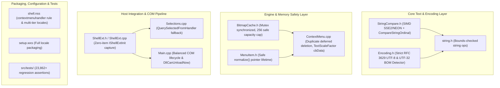

# Nilesoft Shell Revitalization & Maintenance Plan

## 1. Executive Summary & Objectives

The purpose of this document is to track the methodical revitalization of the [Nilesoft Shell](https://github.com/opj161/Shell) codebase. Through an in-depth comparative assessment of community forks (`TCNOco`, `JENJET`, `Roze061`, `xiaobsh`, `9000000`) and expert peer review against Win32 API contracts, we prioritize genuine engine correctness, memory safety, encoding rigor, third-party shell integration, and regression testing over unvetted heuristic patches.

---

## 2. Maintenance Status Matrix

| Component | Status | Details & Implementation Rationale |
| :--- | :---: | :--- |
| **Strict RFC 3629 UTF-8 Validation** | **Implemented** | Replaced flawed table heuristic in `src/shared/System/Text/Encoding.h` with strict validator rejecting truncated multibyte sequences, overlongs (`C0`/`C1`, `E0`/`F0`), surrogates (`U+D800`–`U+DFFF`), and codepoints > `U+10FFFF`. Fixed UTF-32 BOM shadowing by testing 4-byte BOMs before 2-byte BOMs. |
| **Hybrid Unicode Ordinal Comparison** | **Implemented** | `src/shared/System/Text/StringCompare.h` features SSE2/NEON SIMD fast path for ASCII text and identifiers, falling back to Win32 `CompareStringOrdinal(..., TRUE)` when non-ASCII code points (> 0x7F) are present. |
| **Synchronized & Safe Bounded BitmapCache** | **Implemented** | `src/dll/src/Include/BitmapCache.h` raster cache is synchronized with `std::mutex`, bounded to 256 entries without destructive eviction of borrowed raw handles, and verifies full text equality to eliminate 64-bit FNV hash collision risk. |
| **MenuItem Title Lifetime Bug** | **Implemented** | In `src/dll/src/Include/MenuItem.h`, `normalize()` is called *before* saving `dwTypeData = this->title.text` and `cch`, eliminating dangling pointers to reallocated buffers handed to USER32. |
| **Duplicate Menu Replacement & Deferred Deletion** | **Implemented** | In `src/dll/src/ContextMenu.cpp`, duplicate scanning advances `indexof` inside the iteration loop. Displaced items are preserved in `__replaced_system_items` to protect active `__map_system_menu` pointers, and replacement submenu paths are registered in the map. |
| **Win11 TextScaleFactor Buffer Sizing** | **Implemented** | In `src/dll/src/ContextMenu.cpp`, initialized `cbData = sizeof(dwTextScaleFactor)` before `RegGetValueW` and added explicit return validation. |
| **MSI Custom Action String Bugs** | **Implemented** | In `src/setup/ca/dllmain.cpp`, fixed `JoinPath` return value and passed exact byte size to `RegGetValueW` while stripping trailing null characters. |
| **Third-Party Shell Extension Capture** | **Implemented** | `src/dll/src/Include/ShellExt.h` and `src/dll/src/ShellExt.cpp` provide `IShellExtInit` / `IContextMenu` selection capture with thread-local binding, TTL expiry, and honest `com_object_count` tracking for `DllCanUnloadNow`. Tested with both folder and `IDataObject` file selections. |
| **Stock Configuration & Locales** | **Implemented** | `src/bin/shell.nss` sets `exclude.where = !(process.is_explorer or window.is_contextmenuhandler)`, roots language imports against `app.dir`, provides multi-tier fallback (`sys.lang` -> `sys.lang.name` -> `en.nss`), and removes invasive `showdelay = 200`. |
| **WiX Packaging** | **Implemented** | Renamed `es-ES` to `es-ES.nss` and added `LANG2` component in `src/setup/wix/setup.wxs` to package all 9 previously omitted locales. |
| **Balanced COM Lifetime** | **Implemented** | In `src/dll/src/Main.cpp`, single-point scoped `CoInitializeEx` and `CoUninitialize` in SEH `__finally` block. Redundant un-paired `CoInitializeEx` removed from `Initializer`. |
| **GDI & Owner-Draw Safety** | **Implemented** | Disabled arbitrary memory layout scanner from default baseline (`scan_private_layouts = false`). Enforced Win32 contract requiring bitmaps to be deselected from memory DCs before calling `GetDIBits` / `SetDIBits`. |
| **Regression Test Suite** | **Implemented** | Standalone test project in `src/tests/` executing 23,862+ checks covering SIMD folding, strict UTF-8 validation, UTF-32 BOM recognition, thread-safe bitmap cache bounding, and COM selection capture. |
| **Global Loader Lock Mutation** | **Rejected** | Upstream initialization of COM in `DllMain` under loader lock and intrusive global `SPI_SETMENUSHOWDELAY` overrides have been permanently removed. |

---

## 3. Architecture Overview



---

## 4. Verification & Validation Summary

### MSBuild Matrix
- **x64 Release**: Built `shell.dll`, `shell.exe`, `ca.dll`, `setup-x64.msi`, `tests.exe` (0 errors, 0 warnings).
- **x86 Release**: Built `shell.dll`, `shell.exe`, `ca.dll`, `setup-x86.msi`, `tests.exe` (0 errors, 0 warnings).

### Unit Test Execution
```text
[ordinal_fold]   ... 9 checks passed
[ordinal_exact]  ... 2 checks passed (including non_ascii_hybrid_unicode_folds)
[encoding]       ... 5 checks passed (including strict UTF-8 & UTF-32 BOMs)
[bitmapcache]    ... 12 checks passed (including safe capacity limit & atomic thread safety)
[shellext]       ... 9 checks passed (including end-to-end Initialize -> QueryContextMenu and IDataObject file selections)

23862 checks, 0 failure(s)
```
