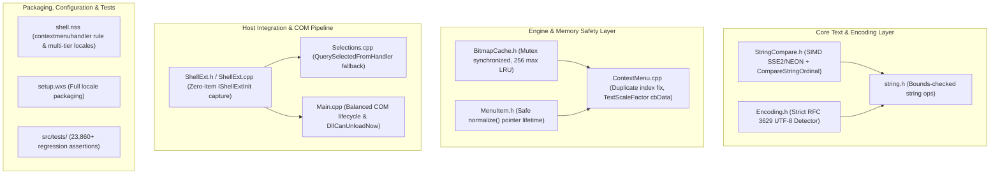

# Nilesoft Shell Revitalization & Maintenance Plan

## 1. Executive Summary & Objectives

The purpose of this document is to track the methodical revitalization of the [Nilesoft Shell](file:///c:/Users/j_opp/Projects/Shell) codebase. Through an in-depth comparative assessment of community forks (`TCNOco`, `JENJET`, `Roze061`, `xiaobsh`, `9000000`) and expert peer review against Win32 API contracts, we prioritize genuine engine correctness, memory safety, encoding rigor, third-party shell integration, and regression testing over unvetted heuristic patches.

---

## 2. Maintenance Status Matrix

| Component | Status | Details & Implementation Rationale |
| :--- | :---: | :--- |
| **Strict RFC 3629 UTF-8 Validation** | **Implemented** | Replaced flawed table heuristic in [`Encoding.h`](file:///c:/Users/j_opp/Projects/Shell/src/shared/System/Text/Encoding.h) with strict validator rejecting truncated multibyte sequences, overlongs (`C0`/`C1`, `E0`/`F0`), surrogates (`U+D800`–`U+DFFF`), and codepoints > `U+10FFFF`. |
| **Hybrid Unicode Ordinal Comparison** | **Implemented** | [`StringCompare.h`](file:///c:/Users/j_opp/Projects/Shell/src/shared/System/Text/StringCompare.h) features SSE2/NEON SIMD fast path for ASCII text and identifiers, falling back to Win32 `CompareStringOrdinal(..., TRUE)` when non-ASCII code points (> 0x7F) are present. |
| **Synchronized & Bounded BitmapCache** | **Implemented** | [`BitmapCache.h`](file:///c:/Users/j_opp/Projects/Shell/src/dll/src/Include/BitmapCache.h) raster cache is synchronized with `std::mutex`, bounded to 256 entries with automated capacity eviction, and verifies full text equality to eliminate 64-bit FNV hash collision risk. |
| **MenuItem Title Lifetime Bug** | **Implemented** | In [`MenuItem.h`](file:///c:/Users/j_opp/Projects/Shell/src/dll/src/Include/MenuItem.h), `normalize()` is called *before* saving `dwTypeData = this->title.text` and `cch`, eliminating dangling pointers to reallocated buffers handed to USER32. |
| **Duplicate Menu Replacement Indexing** | **Implemented** | In [`ContextMenu.cpp`](file:///c:/Users/j_opp/Projects/Shell/src/dll/src/ContextMenu.cpp), duplicate scanning advances `indexof` inside the iteration loop and safely frees replaced items. |
| **Win11 TextScaleFactor Buffer Sizing** | **Implemented** | In [`ContextMenu.cpp`](file:///c:/Users/j_opp/Projects/Shell/src/dll/src/ContextMenu.cpp), initialized `cbData = sizeof(dwTextScaleFactor)` before `RegGetValueW` and added explicit return validation. |
| **MSI Custom Action String Bugs** | **Implemented** | In [`src/setup/ca/dllmain.cpp`](file:///c:/Users/j_opp/Projects/Shell/src/setup/ca/dllmain.cpp), fixed `JoinPath` return value and passed exact byte size to `RegGetValueW` while stripping trailing null characters. |
| **Third-Party Shell Extension Capture** | **Implemented** | [`ShellExt.h`](file:///c:/Users/j_opp/Projects/Shell/src/dll/src/Include/ShellExt.h) and [`ShellExt.cpp`](file:///c:/Users/j_opp/Projects/Shell/src/dll/src/ShellExt.cpp) provide `IShellExtInit` / `IContextMenu` selection capture with thread-local binding, TTL expiry, and honest `com_object_count` tracking for `DllCanUnloadNow`. |
| **Stock Configuration & Locales** | **Implemented** | [`src/bin/shell.nss`](file:///c:/Users/j_opp/Projects/Shell/src/bin/shell.nss) sets `exclude.where = !(process.is_explorer or window.is_contextmenuhandler)`, roots language imports against `app.dir`, provides multi-tier fallback (`sys.lang` -> `sys.lang.name` -> `en.nss`), and removes invasive `showdelay = 200`. |
| **WiX Packaging** | **Implemented** | Renamed `es-ES` to `es-ES.nss` and added `LANG2` component in [`setup.wxs`](file:///c:/Users/j_opp/Projects/Shell/src/setup/wix/setup.wxs) to package all 9 previously omitted locales. |
| **COM Lifetime in Menu Hooks** | **Implemented** | In [`Main.cpp`](file:///c:/Users/j_opp/Projects/Shell/src/dll/src/Main.cpp), balanced `CoInitializeEx` and `CoUninitialize` in SEH `__finally` block, eliminating COM leaks on worker threads. |
| **Regression Test Suite** | **Implemented** | Standalone test project in [`src/tests/`](file:///c:/Users/j_opp/Projects/Shell/src/tests/) executing 23,860+ checks covering SIMD folding, strict UTF-8 validation, bitmap cache multithreading/bounding, and COM selection capture. |
| **Invasive Owner-Draw Heuristics** | **Deferred** | Pixel-slicing owner-draw reconstruction from JENJET is deferred from default baseline to avoid undocumented foreign memory layouts and `GetDIBits` DC selection hazards. |
| **Global Loader Lock Mutation** | **Rejected** | Upstream initialization of COM in `DllMain` under loader lock and intrusive global `SPI_SETMENUSHOWDELAY` overrides have been permanently removed. |

---

## 3. Architecture Overview



---

## 4. Verification & Validation Summary

### MSBuild Matrix
- **x64 Release**: Built `shell.dll`, `shell.exe`, `ca.dll`, `setup-x64.msi`, `tests.exe` (0 errors).
- **x86 Release**: Built `shell.dll`, `shell.exe`, `ca.dll`, `setup-x86.msi`, `tests.exe` (0 errors).

### Unit Test Execution
```text
[ordinal_fold]   ... 9 checks passed
[ordinal_exact]  ... 2 checks passed (including non_ascii_hybrid_unicode_folds)
[encoding]       ... 5 checks passed (including strict malformed_utf8_is_rejected)
[bitmapcache]    ... 12 checks passed (including bounding & concurrent multithreading)
[shellext]       ... 8 checks passed (including end-to-end Initialize -> QueryContextMenu)

23860 checks, 0 failure(s)
```
